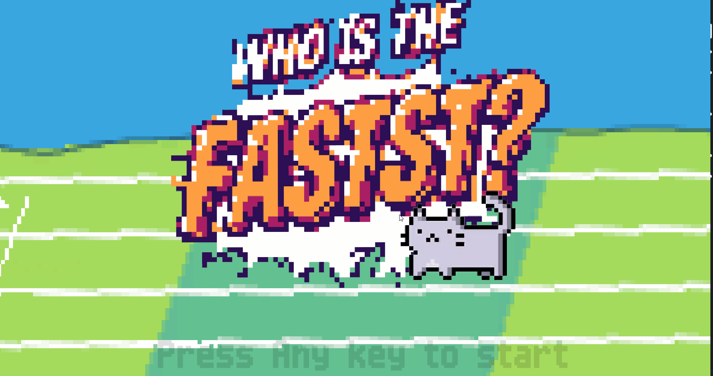
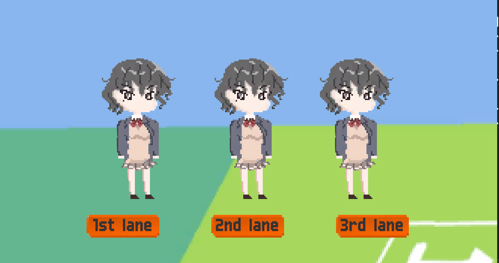

# Race random game


---

## Table of Contents
1. [Overview](#overview)
2. [How To Play](#How-To-Play)
3. [Key Code](#key-code)
4. [Improvements](#improvements)

---

# Overview


- **Technology Stack**: Unity, C#, ClipStudio, etc.  
- **Main Features**: 
  - A single click generates random ranks in race for 3 participants and displays the results instantly
  - Useful when you record random rank among 3 people
  - Game menu is supported
  - I own every right of source file including image file
  


---

# How To Play
  


Press any key to start!



Pick your lane among three!


Wait for the result!

You win!

---

# Key Code
Highlight important portions of the code:

**Code In Fading Game UI**
```csharp
public class ReadyController : MonoBehaviour
{
    public CanvasGroup readyCanvasGroup; // Ready 에셋의 CanvasGroup
    public float standbytime = 0f;
    public float displayTime = 2f; 
    public float fadeDuration = 1f; 

    void Start()
    {   
        StartCoroutine(ShowReadyWithFade());
    }

    IEnumerator ShowReadyWithFade()
    { 
        yield return new WaitForSeconds(standbytime);
        // fade in
        yield return Fade(0, 1, fadeDuration);

        // Ready and standby
        yield return new WaitForSeconds(displayTime);

        // fade out
        yield return Fade(1, 0, fadeDuration);

        // hide Ready Asset
        gameObject.SetActive(false);
    }

    IEnumerator Fade(float startAlpha, float endAlpha, float duration)
    {
        float elapsed = 0f;
        while (elapsed < duration)
        {
            elapsed += Time.deltaTime;
            float alpha = Mathf.Lerp(startAlpha, endAlpha, elapsed / duration);
            readyCanvasGroup.alpha = alpha;
            yield return null;
        }
        readyCanvasGroup.alpha = endAlpha;
    }
}
```

## Unity Fade Effect with Linear Algebra Perspective

This document explores how the Unity fade effect implementation relates to concepts **Linear Algebra**, such as **linear transformations**, **vector spaces**, and **scaling operations**. We will focus on connecting the mathematical principles with practical coding in Unity.

---

### 1. Unity Fade Effect and Linear Interpolation

In Unity, the fade effect leverages **linear interpolation** (`Mathf.Lerp`) to compute intermediate alpha values, enabling smooth fade-in and fade-out transitions. This directly relates to **linear transformations** in vector spaces, as described in the PDF.

#### Formula for Linear Interpolation

The transition of alpha values from `startAlpha` to `endAlpha` over time is expressed as:

alpha(t) = (1 - t) * startAlpha + t * endAlpha, where 0 ≤ t ≤ 1


- **\( t \):** A scalar value linearly progressing from 0 to 1.
- **\( startAlpha \):** The initial alpha (transparency) value.
- **\( endAlpha \):** The final alpha value.

This formula demonstrates scalar multiplication and addition, foundational operations in vector spaces.

---

### 2. Vector Space Extension: Transparency and Position Interpolation

The Unity fade effect operates within a 1D scalar space for alpha values. By extending this principle to 3D vectors, we unlock broader applications like **position interpolation**.

#### Mathematical Formula for 3D Interpolation

P(t) = (1 - t) * A + t * B, where 0 ≤ t ≤ 1


- **\( P(t) \):** The interpolated position at time \( t \).
- **\( A \):** The starting position vector.
- **\( B \):** The ending position vector.

Unity implements this using `Vector3.Lerp`, which reinforces concepts of **linear transformations** and **vector spaces**. Beyond transparency interpolation, `Vector3.Lerp` is versatile for animations and movements in 2D or 3D spaces, such as character movement or object transitions.

---
**Code In Spawning Obastacles**
```csharp
using System.Collections;
using System.Collections.Generic;
using UnityEngine;

public class Obstaclespawner : MonoBehaviour
{

    public GameObject[] objectsToSpawn;


    [SerializeField] float [] spawnArea;
    [SerializeField] int [] yspawnArea;
    [SerializeField] int laneNum;
    [SerializeField] int spawnNum;
    Vector2 [][] spawnPosition;
    


    void Start()
    {   
        spawnPosition = new Vector2[laneNum][];
    for (int i = 0; i < laneNum; i++){
        spawnPosition[i] = new Vector2[spawnNum]; 
    }
        Invoke("SpawnObject", 0);
        
    }

    void SpawnObject()
    {
        int[] numbers = new int[spawnArea.Length];
        for(int i = 0; i < laneNum; i++){
            for(int j = 0; j < numbers.Length; j++){
                numbers[j] = j;
            }
            for (int j = numbers.Length - 1; j >= 0; j--){//Fisher-Yates Shuffle Algorithm
                    int randomidx = Random.Range(0, j + 1);
                    int temp = numbers[j];
                    numbers[j] = numbers[randomidx];
                    numbers[randomidx] = temp;
                }// calculate random position
            for(int j = 0; j < spawnNum; j++){
                spawnPosition[i][j] = new Vector2(spawnArea[numbers[j]] - i * 1.5f, yspawnArea[i]);
            }
        }

        // select random object
        int randomObjectIndex;

        // spawn object
        for(int i = 0; i < laneNum; i++){
            for(int j = 0; j < spawnNum; j++){
                randomObjectIndex = Random.Range(0, objectsToSpawn.Length);
                Instantiate(objectsToSpawn[randomObjectIndex], spawnPosition[i][j], Quaternion.identity);
            }
        }
    }
}

```
## Fisher-Yates Shuffle Algorithm

The **Fisher-Yates Shuffle** is an algorithm designed to randomize the order of elements in a list, ensuring that all possible permutations are equally likely. It achieves this by swapping elements directly while maintaining uniform randomness.

---

### 1. Algorithm Overview

The Fisher-Yates Shuffle operates as follows:

1. Start with the last element of the array.
2. For each position, randomly select an element from the unshuffled portion (including the current position).
3. Swap the selected element with the current element.
4. Repeat until all elements have been processed.


---

### 2. Adaptation

With this algorithm, we can spawn obstacles in identical probability which ensures fair game result.


